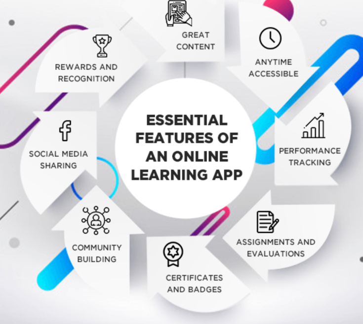
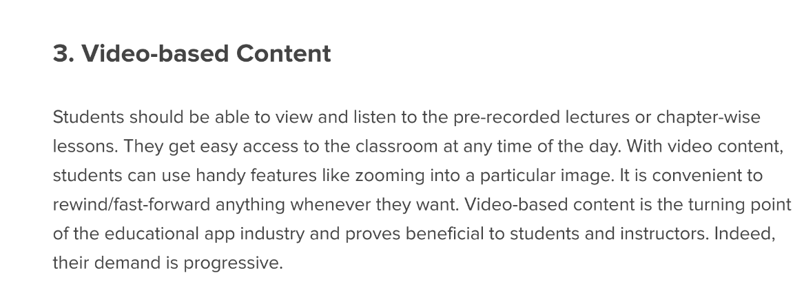

# 13 Must-Have Features of Successful Educational Apps

This README outlines the 13 key features for creating a successful educational app, based on essential user-centric elements, engagement methods, and cutting-edge AI enhancements. These features aim to improve student learning experiences, provide valuable tools for teachers, and create a sustainable, interactive, and personalized platform.

---

## Features

### 1. **Live Tutorials and Sessions**
Host **interactive live sessions** and tutorials to allow students to polish their skills in real-time. Features like **‘Chat Now’** allow students to ask queries and get instant answers from instructors, recreating a virtual classroom environment. 

### 2. **Offline Mode**
Ensure learning continuity by offering an **offline mode**, where students can download course materials. This feature helps users in areas with limited internet access to continue learning even when offline. 

### 3. **Gamification**
Incorporate **gamification** to increase engagement. Award **badges** or points for achievements, motivating students through competition and fun. This feature helps in cognitive development and makes learning interactive and enjoyable.

### 4. **Rating System**
Introduce a **rating system** where students receive ratings or points for accomplishments, fostering motivation to continue learning and improve.

### 5. **Progress Tracking**
Enable students to **track their progress** with regular tests and reports. By monitoring their development, students can adjust their learning path and remain motivated to achieve their academic goals.

### 6. **Certifications and Recognition**
Provide students with **certifications** and **badges** as recognition for course completion and achievements. These are a great way to boost student morale and give tangible proof of their efforts and skills.

### 7. **Community Building**
Create an environment for **interaction between students and instructors** via a built-in community. Encourage healthy discussions, after-lecture chats, and a **FAQ section** to clarify doubts and promote collaboration.

### 8. **Personalization**
Offer **personalized learning paths**, tailoring content to each student’s pace and preferences. This custom experience is more effective than static websites or traditional textbooks.

### 9. **Real-Time Feedback**
Provide **instant feedback** to help students learn from mistakes and solidify concepts immediately. Real-time feedback enhances the learning process and improves retention.

### 10. **Continuous Improvement through User Feedback**
Keep improving your app by gathering feedback from both students and teachers. Regular updates and enhancements based on feedback keep the app relevant and useful.

### 11. **AI-Powered Recommendations**
Utilize AI to generate **personalized study guides**, **adaptive learning paths**, and **AI-driven grading**. These tools help students focus on their weaknesses and track performance more efficiently.

### 12. **Gamified Competitions**
Host **real-time competitions** where students compete with peers through **AI-graded quizzes**. This engages students in a competitive and fun environment, encouraging continuous learning.

### 13. **AI-Assisted Grading and Feedback**
Implement **AI for instant grading** and feedback. Detailed explanations for mistakes help students understand their errors, while AI-graded essays can improve writing skills by analyzing structure and content.

---

## How to Use

1. **Download the App** – Available on iOS and Android.
2. **Register or Log In** – Create an account to start learning.
3. **Explore Features** – Take live sessions, download courses for offline study, track progress, and earn badges.
4. **Join the Community** – Interact with peers and instructors, share ideas, and solve doubts.

---

## Key Benefits

- **Inclusive Access**: Offline mode and assistive technology integration for students with disabilities.
- **Engaging Learning**: Gamification and real-time competitions to motivate students.
- **AI-Powered Tools**: Personalized learning paths, instant feedback, and AI-driven study guides.
- **Continuous Learning**: Regular updates and improvement based on user feedback.

---

By integrating these must-have features, you create an educational app that offers personalized, engaging, and accessible learning experiences, driving both student success and satisfaction.

